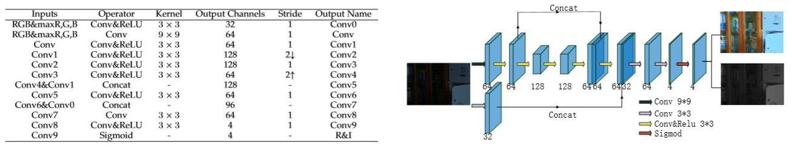

<!--more-->

# Self-supervised Image Enhancement Network: Training with Low Light Images Only

## 主要贡献

* 基于最大熵和 Retinex 模型，构建了一个无监督的低光照图像增强网络，不需要paired图像训练。甚至是可以只用一张图像训练网络。
* 提出的网络速度很快

## 主要方法

​	文章的思想是。设计一个网络，分解产生 反射率图 和 光照图。而为了实现自监督的目的，即仅仅使用低光照图像来训练，就需要设计一系列的损失函数来约束网络学习的方向。这里主要就用到了熵最大化的约束条件。熵最大化就是当图像的直方图分布服从均匀分布时，它的熵最大，因此 反射率图的学习 很大程度上是依赖这个熵最大化约束，否则在没有参考的正常图像的情况下没法学到合理的 反射率。

### 损失函数

1. 重建损失，和常规的一样

2. 反射率图 R 的约束：

   $$l_{R}=\left\|\max _{c \in R, G, B} R^{c}-F\left(\max _{c \in R, G, B} S^{c}\right)\right\|_{1}+\lambda\|\triangle R\|_{1}$$

   其中 $F(.)$ 代表直方图均衡化后的结果。第一项的含义为，取输入低光照图像的最大亮度通道（并非固定的R,G,B中的一个），对它做直方图均衡化，并将这个作为网络输出的反射率图的最大通达的参考结果。第二项对反射率图的梯度约束的作用是抑制噪声。

   使用最大像素通道的目的：

   * 对于弱光图像，最大通道对其视觉效果的影响最大
   * 如果选择其他通道，则可能会出现通道值的饱和，因为控制住最大通道得像素值不饱和，那么其他低于他的像素值肯定不会饱和。
   * 如果我们选择其中一个颜色通道，比如R, G或B通道，就不符合自然图像规律。

   使用直方图均衡化的原因

   * 直方图均衡化可以大大提高图像的信息熵。

3. 光照图的约束，采用的即为Retinex-Net 这篇文章中的损失

$$
\mathcal{L}_{i s}=\sum\left\|\nabla I_{i} \circ \exp \left(-\lambda_{g} \nabla R_{i}\right)\right\|
$$

4. 综合上述，即为本文的损失函数

### 优点

​	大部分基于模型的方法，其实就是类似上述设计一个根据各种先验设计损失函数，然后将损失函数转换到频域使用FFT加快计算，不断迭代得到增强结果。上式设计的损失函数其实也可以类似优化，但是作者是使用一个小网络来完成的，之所以选用后者的方法，有如下原因：

1. 使用传统的FFT优化，在每一张图像增强的过程中都需要 迭代优化，而且损失函数越复杂，计算量就越大，不同图像迭代次数也不一样时间开销也不一样。

2. 同时，传统的解决方案不能利用大数据，以前的数据处理对新的数据处理毫无帮助。

3. 与有监督的CNN方法比，这种方法不需要精心设计的训练数据就能达到较好的效果，且精心设计的参考图像不一定能包含实际需要的所有场景，泛化能力不好。相对基于模型的传统方法，本文的算法在计算速度上有有优势。

   

### 网络结构

​	关于结构，卷积层和sigmod层的叠加也可以产生可以接受的结果。然而，如果添加一些concat层，增强结果将变得更加清晰。作者还采用了上采样和下采样的结构，这样的结构可以起到抑制噪声的作用，但是有些场合中会带来模糊的效果。

## 实验

### 实验细节

​	使用LOL dataset中的485张 低光照图像训练，15张做测试。batch_size = 16，path_size=48x48

### 训练时间的影响

​	作者训练了1000epoch，没20epoch在测试集上计算一次 各种指标，包括GE CE GMI SSIM NIQE.... 最终的结论是，取在 200epoch输出的模型参数。因为随着 epoch的增加，虽然一些表征清晰度的指标会效果变好，但是像SSIM这种有参考图像的指标会越来越差，这是因为噪声的影响。所以为了在噪音和清晰度之间保持一个平衡，选择在200epoch停止。

### 重复稳定性

​	这部分实验目的就是 反复训练几次，对比每次训练的结果是不是可以反复复现。结论是 一些指标不是特别稳定，这可能是由于 L1 损失函数的解不唯一的原因？但是 整体出来的视觉效果差不多，所以说 该文方法可重复复现，具有稳定性。

### 与其他方法对比

